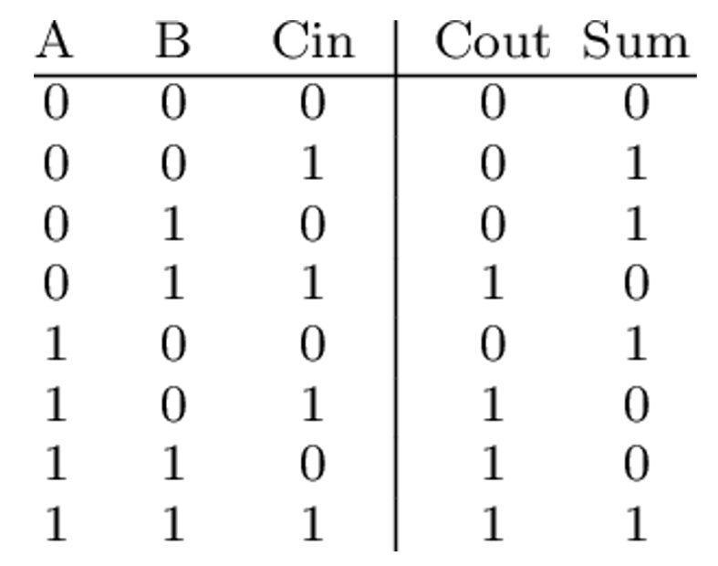
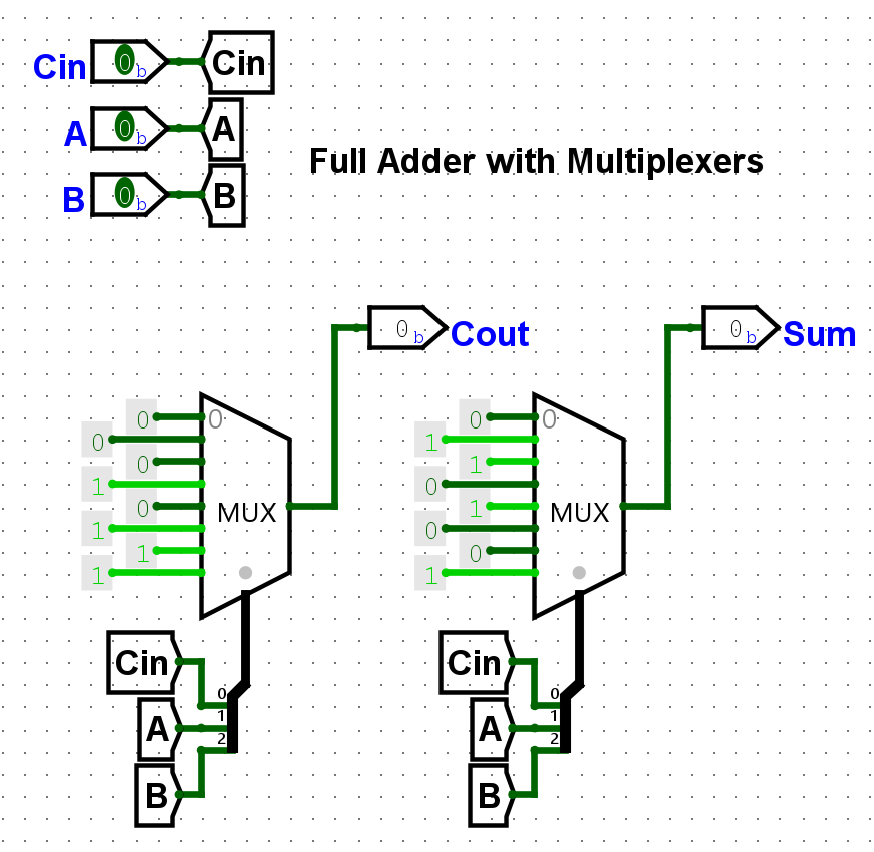
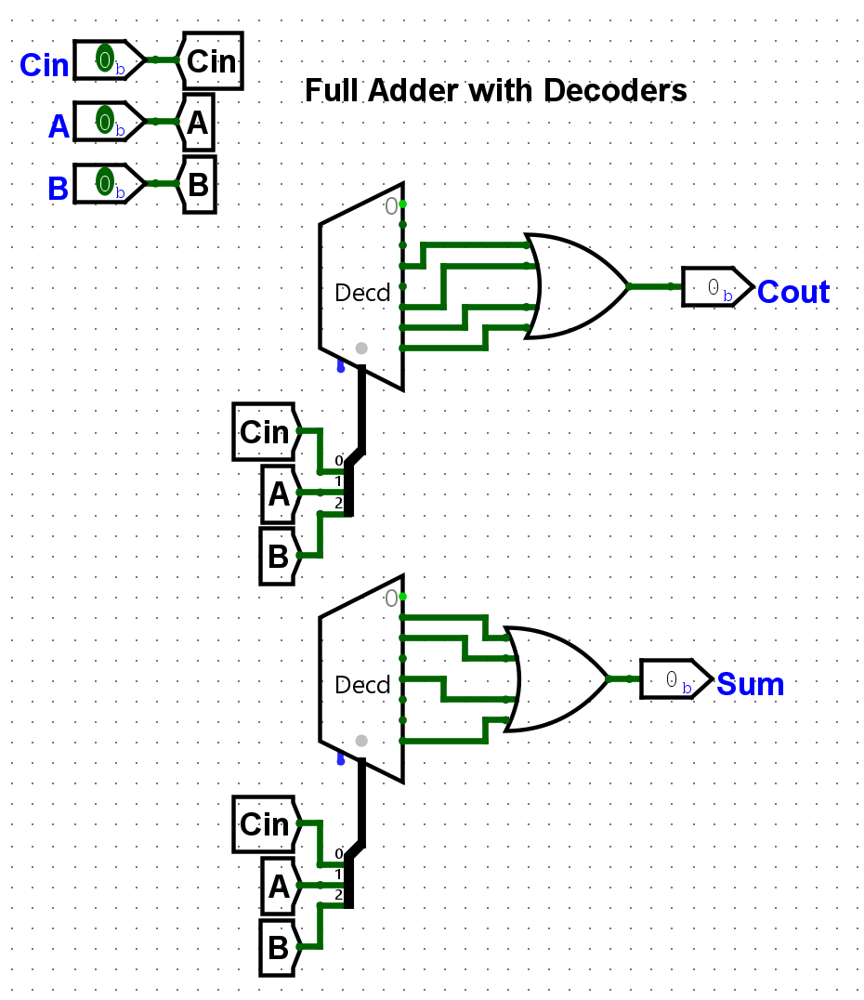
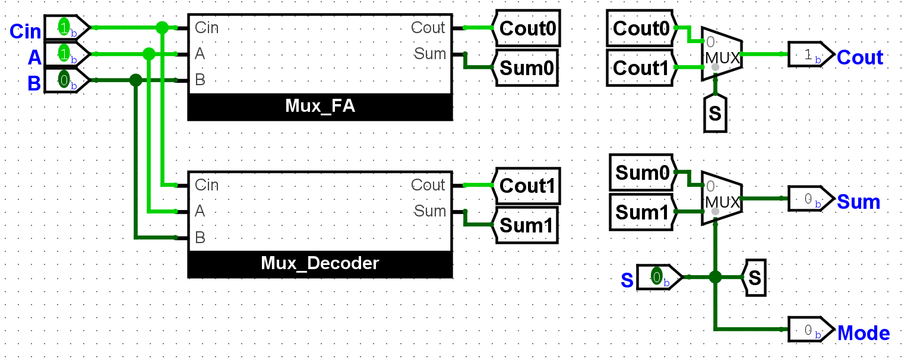

# In Class Activity
**Goncalo Martins**

**October 10th 2026**

## Introduction

This activity describes the design of a Full Adder (FA) using multiplexers and decoders.

The truth table for a FA is below.

<!--  -->

## Schematic: Full Adder with Multiplexers

This section shows the design with two multiplixers to represent Cout and Sum respectively.

## Schematic: Full Adder with Decoders

This section shows the design with two decoders and OR gates to represent Cout and Sum respectively.

## Test Circuit

On the final test circuit I added a multiplexer that alternates between the two solutions. The **Mode** output shows which design is affecting the **Cout** and **Sum** outputs.

<video src="img/video_1.mp4" controls width="100%"></video>
